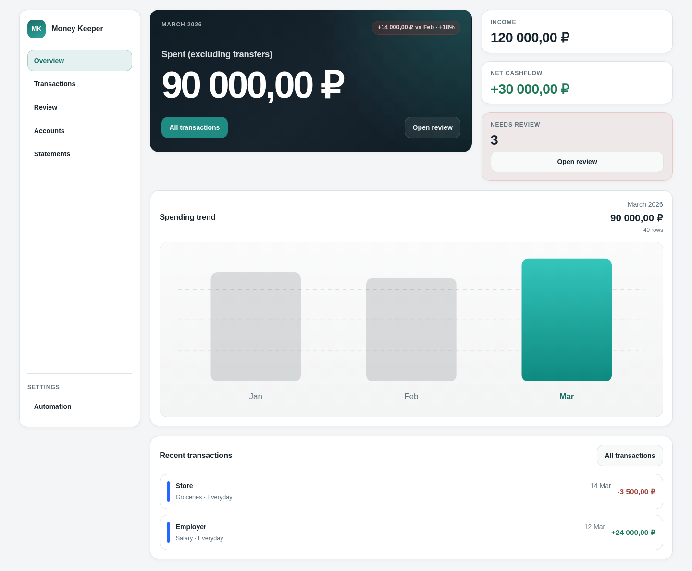

# Money Keeper

Money Keeper is a self-hosted, PDF-first personal finance workspace. It imports bank
statements, normalizes transactions, identifies transfers, and surfaces uncertain
records for review instead of silently guessing.



## What is included

- FastAPI backend with statement import, analytics, rules, transfer detection, and
  net-worth endpoints
- React and TypeScript workspace for overview, transactions, review, accounts,
  statements, and automation rules
- Telegram bot for statement upload and review workflows
- PostgreSQL persistence with explicit test-database isolation
- Docker Compose development stack, CI, unit tests, integration tests, and visual
  regression fixtures

## Architecture

```text
Bank statement PDF
       |
       v
Telegram bot or web upload
       |
       v
FastAPI import pipeline -----> PostgreSQL
       |                          |
       +---- parsing/review ------+
       |
       v
React workspace: analytics, transactions, accounts, and review
```

## Quick start

Requirements:

- Docker with Docker Compose
- An external PostgreSQL database (Supabase works well)
- A Telegram bot token only if you want to run the bot

Create local configuration:

```bash
cp .env.example .env
```

Fill in `DATABASE_URL` and generate a strong `API_ADMIN_TOKEN`. Then start the stack:

```bash
make up
```

Local services:

- Web UI: <http://localhost:3001>
- API health check: <http://localhost:8010/api/health>

The Telegram bot is optional. Leave `BOT_TOKEN` empty if you only need the web
workspace and API.

## Development

Backend and bot dependencies:

```bash
python -m venv .venv
source .venv/bin/activate
pip install -r api/requirements.txt -r bot/requirements.txt
```

Frontend:

```bash
cd web-react
npm ci
npm run dev
```

Useful checks:

```bash
make lint
make typecheck
cd web-react && npm test
cd web-react && npm run build
```

Database integration tests require an isolated PostgreSQL schema. See
`.github/workflows/ci.yml` for a reproducible configuration.

## Configuration

The stack loads local settings from `.env`. Important variables are documented in
`.env.example`:

- `DATABASE_URL`: PostgreSQL connection URL
- `API_ADMIN_TOKEN`: shared secret used for write operations
- `CORS_ALLOWED_ORIGINS`: comma-separated browser origins
- `BOT_TOKEN`: optional Telegram bot token
- `OWNER_TELEGRAM_ID`: optional restriction to one Telegram user
- `DB_SEARCH_PATH`: optional PostgreSQL search path

## Data safety

This public repository contains no real bank statements, credentials, exports, or
personal transaction history. PDF and data-export formats are ignored by default.
Keep real statements in the runtime upload directory and never add them to Git.

The project stores uploaded PDFs under `data/uploads` and treats parsing as
best-effort. Review uncertain imports before relying on analytics.

## Project layout

```text
api/         FastAPI backend, domain logic, parsers, and tests
bot/         Telegram upload and review bot
web-react/   React application, component tests, and Playwright specs
scripts/     Auditing and data-maintenance utilities
docs/        Product direction, page contracts, and architecture decisions
```
